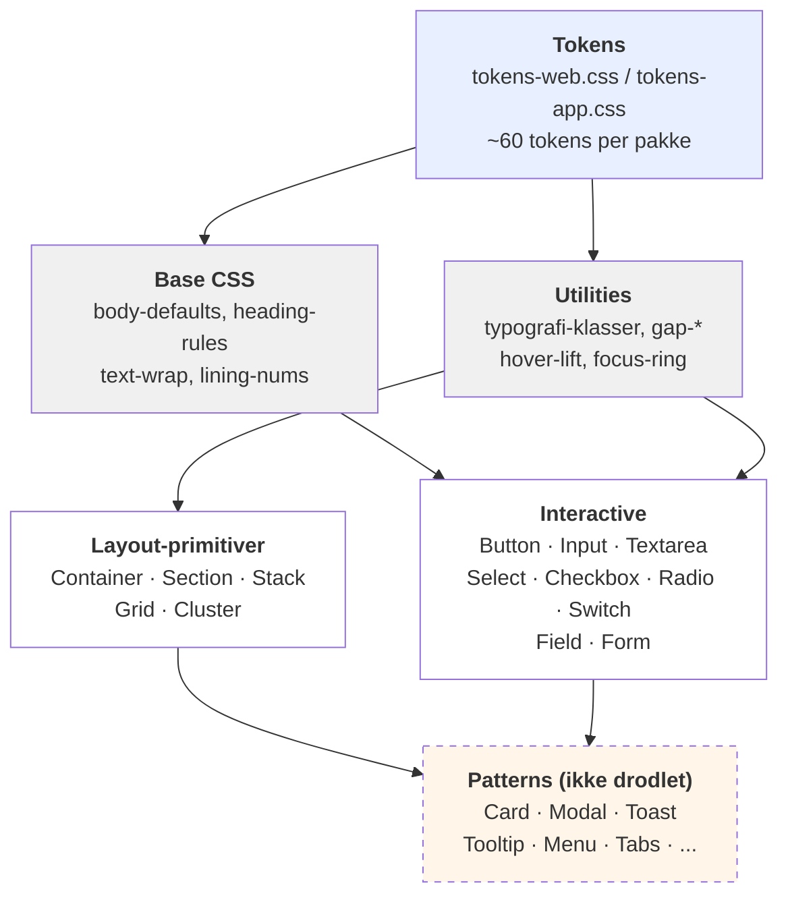
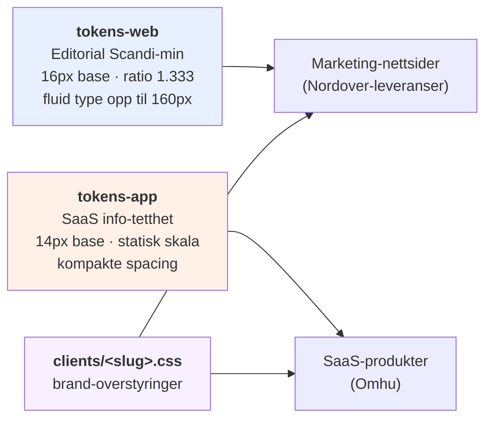
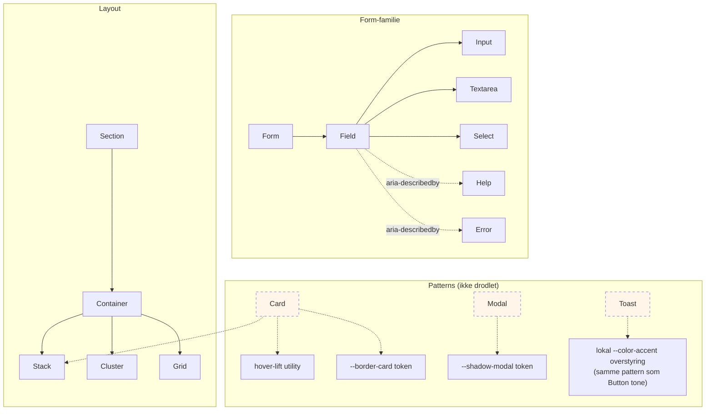
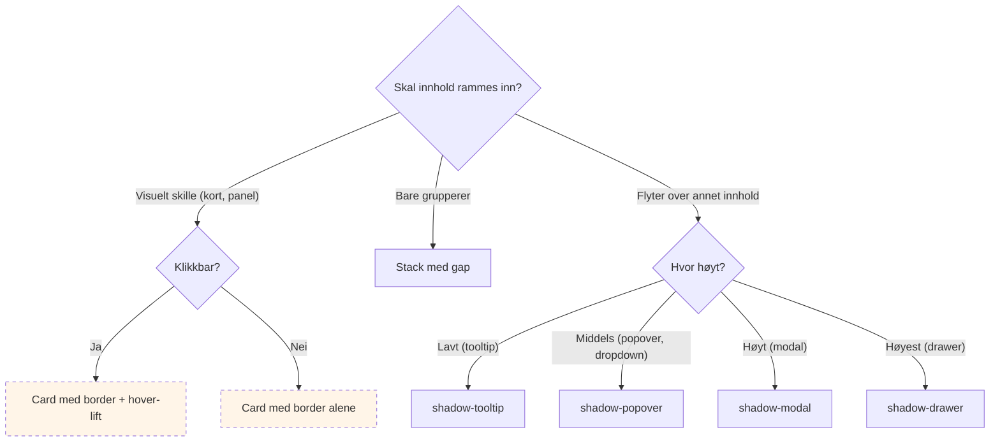

# Nordover-rammeverk — visuell oversikt

Arkitektur-diagrammer over hvordan alt henger sammen. For rendert design-spesimen (faktiske farger, typografi, knapper), åpne [`docs/visual/preview.html`](../../visual/preview.html) i en browser.

## Lag-diagram

Rammeverket er bygget i 5 lag. Hvert lag avhenger av de under, og eksponerer noe nytt til de over.

## Token-namespace

To token-pakker for to bruksområder. Brand-overstyring per kunde via en tredje CSS-fil.

## Komponent-avhengighet (utvalgt)

Hvordan komponenter komponerer fra primitivene. Stiplet = pattern, ikke implementert.

## Import-rekkefølge i en app

Hvordan CSS-filene stables i et Nordover-prosjekt.

```mermaid
graph LR
  T["tokens-web.css<br/>eller tokens-app.css"] --> Base["base.css<br/>body, h1-h6, table"]
  Base --> Typ["typografi.css<br/>semantiske klasser"]
  Typ --> Layout["layout.css<br/>Container, Section, ..."]
  Layout --> Elev["elevation.css<br/>hover-lift"]
  Elev --> Btn["buttons.css"]
  Btn --> Forms["forms.css"]
  Forms --> Prose["prose.css"]
  Prose --> Brand["clients/&lt;slug&gt;.css<br/>brand-overstyring"]

  style T fill:#e8f0ff
  style Brand fill:#f8f0ff
```

## Decision-tree: når bruker du hva?

## Se også

- [Nordover-rammeverk — index](nordover-rammeverk.md)
- [Visuell spesimen (HTML)](../../visual/preview.html) — alle tokens og primitiver rendret
- [Decisions-mappe](../decisions/)
